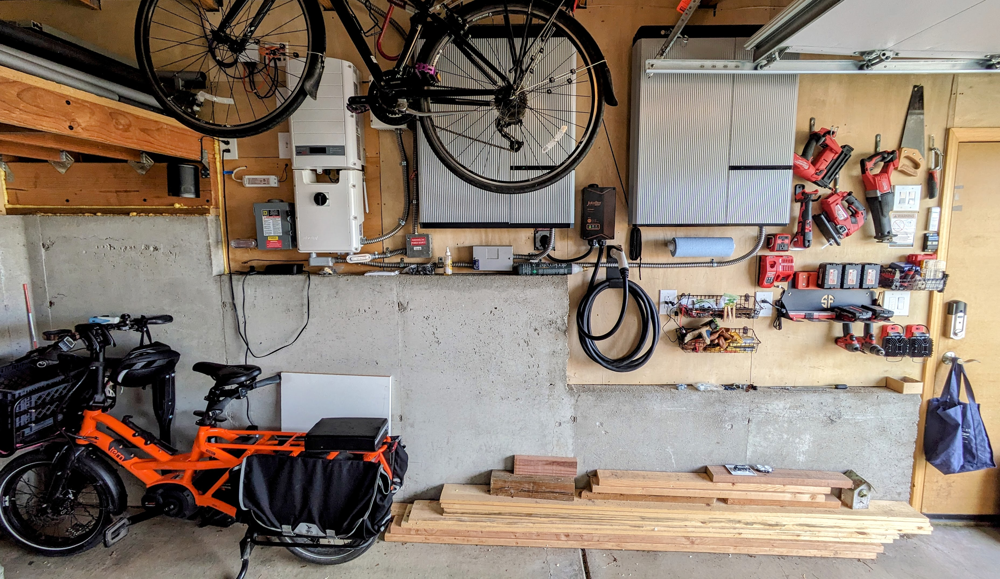
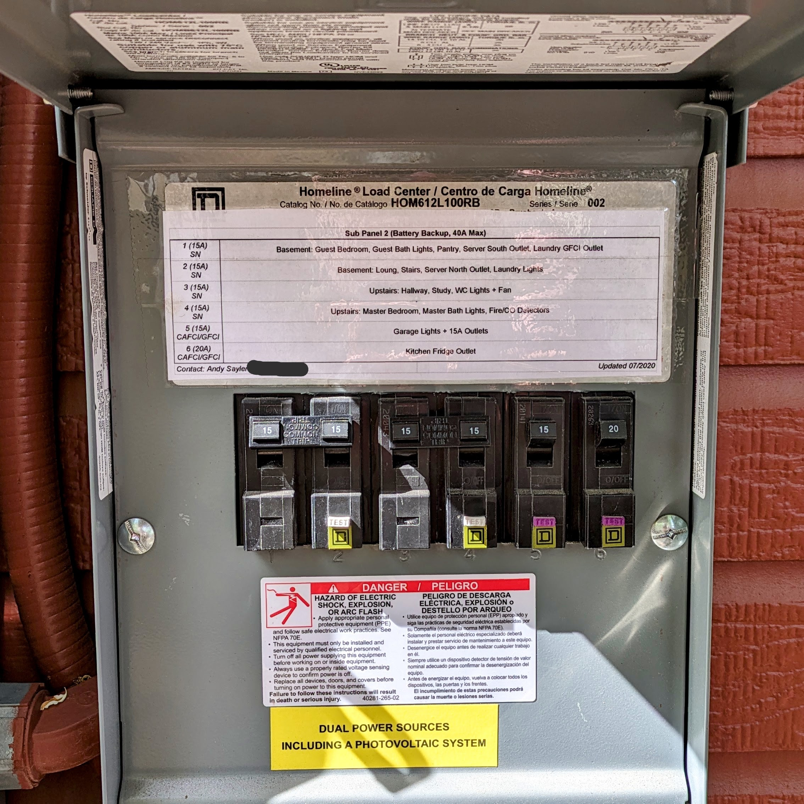
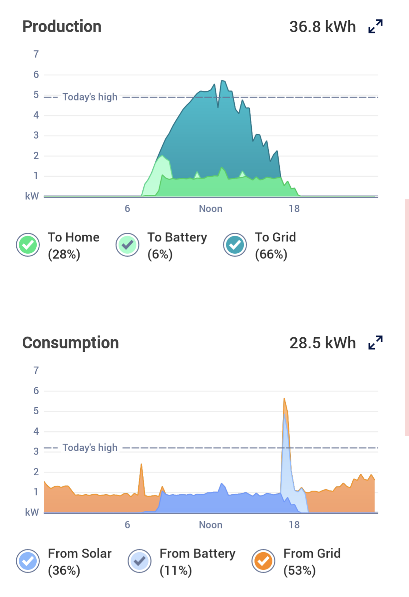
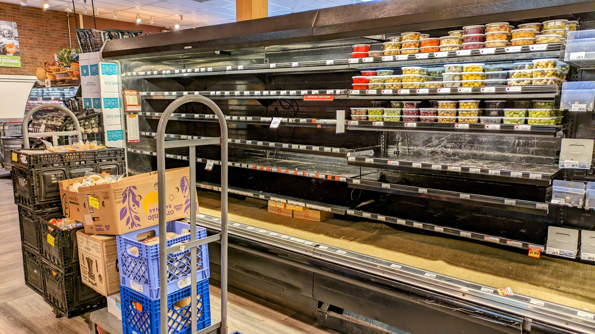
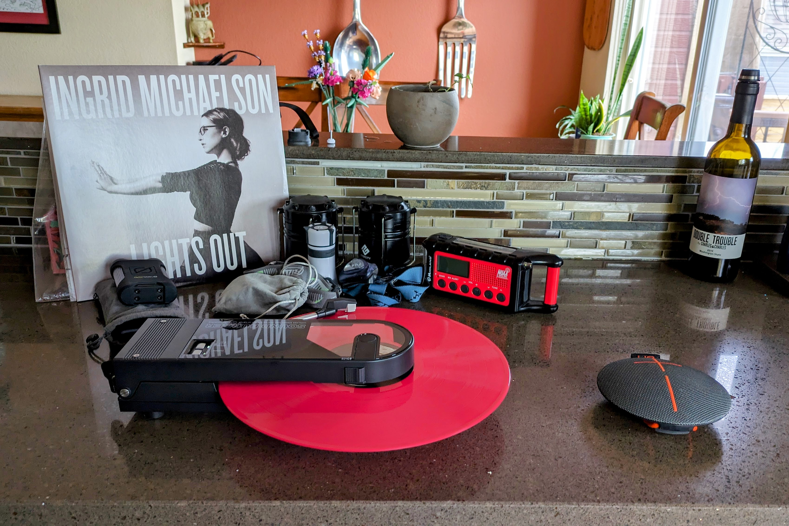
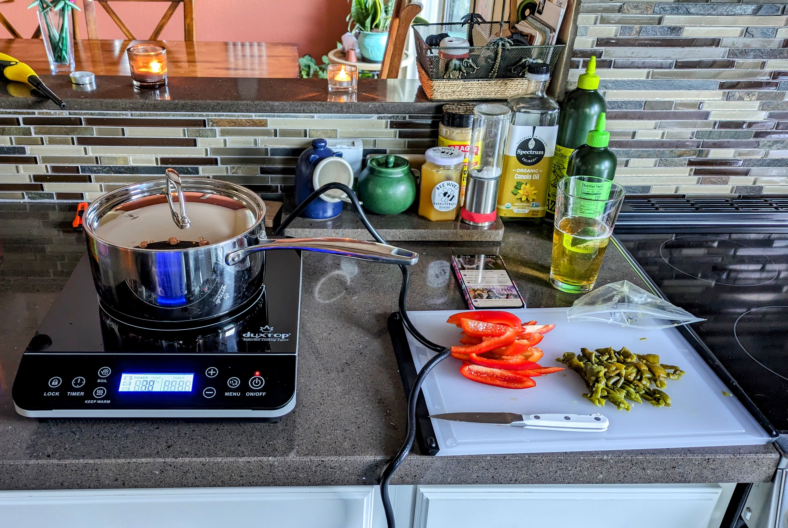
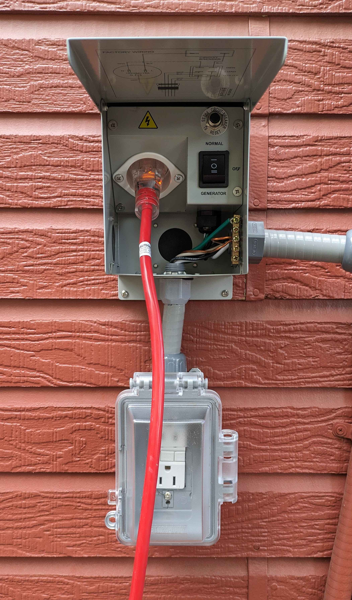

+++
title = "The 2024 Boulder Public Safety Power Shutoff"
date = 2024-05-12T23:03:03-06:00
draft = false
+++

On the afternoon of Saturday, April 6th, 2024, at 12:51 PM, I (and a
good chunk of Boulder's other resident) received the following email
from Xcel, our local power company:

> ## Public Safety Power Outages Planned for Your Area
> 
> This is an important update based on high winds and wildfire
> conditions forecast for your area, which will include proactively
> shutting off power to your community.
> 
> Impact to your electrical service: Our top priority is ensuring the
> safety of our communities, customers and work crews. Due to
> exceptionally high winds and high risk of wind-driven wildfire in your
> area today, electric service at your location will be affected by a
> temporary safety-related power shutoff beginning around 3 p.m. this
> afternoon, extending until at least noon Sunday, April 7, though
> outages are likely to persist beyond that timeframe.

While these sort of thing has been happening for some time now in
[places like California](https://www.cpuc.ca.gov/psps/), it's a new
phenomenon in our state of Colorado. In fact, this was the first time
a power company in Colorado initiated such a "Public Safety Power
Shutoff" (abbreviated "PSPS", which I can only assume is pronounced
like you're talking to a cat).

And thus began our foray into what would ultimately be a 28 hour power
outage -- the longest I've experienced in ~13 years of living in
Boulder.

# A bit of background...

As someone who does risk management for a living, I have, shall we
say, some prepper-adjacent tendencies. Not the kind that leads one to
stockpile an arsenal of Kalashnikovs in the basemen. More the kind
with a well-stocked pantry, enough water for a week, and food canning
skills that would make a tradwife influencer blush.

In this particular case, those tendencies translated into having
previously installed a grid-tied battery backup system as part of our
home solar setup. This system provides ~19.6 kWh of backup capacity
via a pair of [LG RESU10H](https://www.lghomebattery.com.au/resu10h)
batteries tied into our [SolarEdge SE7600A
inverter](https://www.solaredge.com/sites/default/files/se-single-phase-us-inverter-datasheet.pdf).
Unlike the better-known Tesla Power Wall batteries, the LG batteries
sit on the DC-side of the inverter and can be charged directly from
the home's solar panels or from the power grid itself (via the
inverter) when solar is not available. They're part of our home's 6.45
kW solar power system composed of 12 PowerXT 355W panels and 6 PowerXT
365 panels mounted on the roof of our house and garage. You can see our
two batteries (gray boxes center and right) and inverter (white box on
the left) mounted on the wall of our garage in this image (cargo bike
for scale).

Our battery systems serves two main purposes:

* **Production and Load Shifting:** Batteries allow us to store excess
  solar energy when we're producing it, and to use this power later in
  the day when solar production begins to drop off. This allows us to
  consume more of our self-generated power than we would normally be
  able to consume, and aligns well with Xcel's time of use pricing by
  minimize the electricity we buy from Xcel between 1PM and 7PM when
  rates are high. As a result, almost all the power we buy from Xcel
  comes during the off-peak periods when rates are low.
* **Emergency Backup:** The batteries also allow our home to run
  off-grid during a power outage (sometimes called "islanding"). Due
  to their limited out capacity (~40A @ 240V), the backup batteries do
  not power the entire home. Instead they power a set of critical
  circuits including the outlets and lights in the living spaces of
  our house, the fridge, the network/Internet equipment, and a
  smattering of other essential gear.

This is the sub-panel with our backed-up circuits. In normal
operation, The backup circuits draw a baseline load of about 600W --
mainly from the fridge (~100W) and a slightly-abnormal amount of
always-on home network and computer gear (~500W).

Here's a graph of a fairly typical day of generation and use at our
house. Note the production and load shifting that occurs when the
battery charges early in the morning from the solar and then
discharges when we're cooking dinner in the evening on our induction
range. This saves us having to pay the higher electrical rates when
cooking dinner.

# The lead up

The first warning we received about the potential for a power outage
came from Xcel around 6:30 PM on the evening of the day prior (Friday,
April 5th):

> ## Increased Risk of Weather Related Outages
> 
> We are contacting you with an important update based on high winds and
> wildfire conditions forecast for your area, which may lead to
> proactively shutting off power to your community.
> 
> Current situation: Xcel Energy is preparing for high winds this
> weekend and is operating the electric system in some areas of Colorado
> in a manner intended to enhance public safety and decrease the risk of
> wildfire. With the high winds associated with this weather event,
> damage to electrical equipment and power outages may occur. Outages
> may be more frequent and last longer than they typically would.

At that time, Xcel had not yet announced its intention to do a
proactive outage, and instead simply issued a warning regarding the
possibility of outages as they have done in prior windstorms.

Our neighborhood was built in the late 1990s. Most the power lines are
underground. Underground power is very reliable. In our seven years in
this neighborhood, we've never experienced a power outage lasting more
than an hour. We've received warnings like this from Xcel before, and
have gotten in the habit of ignoring them.

Our SolarEdge battery system has a feature called [Weather
Guard](https://www.solaredge.com/us/weather-guard-home-backup) where
it attempts to charge the batteries to 100% (and avoids discharging
them while utility power is available). The mode kicks when the local
weather is predicted to do something where a power outage is
likely. This system kicked in automatically the morning prior to the
shut down based on the high wind warning that had gone into effect. As
a result, both batteries charged to 100% on Saturday morning and
remained there until the outage began.

Around 10AM on Saturday, we received a second notice from Xcel that
amended to prior notice to include:

> Impact to your electrical service: Our top priority is ensuring the
> safety of our communities, customers and work crews. Due to
> exceptionally high winds and high risk of wind-driven wildfire in your
> area today, electric service at your location will be affected by a
> temporary safety-related power shutoff beginning around 3 p.m. this
> afternoon, extending until at least noon Sunday, April 7, though
> outages are likely to persist beyond that timeframe.

This was the first notice to inform us of the planned Public Safety
Power Shutdown. But it wasn't until the Noon email in the start of
this post that Xcel actually led with that headline. Once the Noon
email hit, folks took notice. A quick stop by our local grocery store
revealed a hurried effort to clear everything out of the refrigerated
shelves in preparation for the outage.

# The outage

At 3 PM sharp, Xcel cut our neighborhood's power. I happen to have a
battery powered turntable, so the occasion called for some music:

The story of how our home handled the outage is best told with the
image below. The upper graph shows power output at the inverter and
both the batteries. The lower graph shows the state of charge of each
battery. The red vertical lines indicate when the power was cut and
restored by Xcel. The yellow rectangles show the periods we were
running off solar power alone. The reminder of the graph is when we
were running off battery power. Positive inverter power shows when
power is flowing from the batteries or solar panels to the house or
grid. Negative inverter power is when the batteries are being charged
from the grid.

Starting from when Xcel cut the power at 3 PM on Saturday through
about 6:30 PM that evening, we were operating off solar power alone
and the batteries remained fully charged. Once the sun set around
6:30, the system switched over to the battery backup, starting with
Battery 1 (the primary LG battery). Our ~500W load drew the battery
down at a rate of ~7.5%/hour. Around 10 PM, the system switched from
the main battery (which had been drawn down to about 70%) to the
secondary battery (which is still fully charged). Why did it switch? I
have no idea. This is all proprietary SolarEdge control logic.

The secondary battery continued to power us through the rest of the
night, ending at about 15% charge when the sun comes up on Sunday
morning. Overall, the combined charge state bottomed out at about 40%
when we switched back over to running off solar around 7AM Sunday
morning. At 40%, we actually had capacity to spare during the first
night (but did, in fact, need two batteries to get through the night,
one alone would not have made it).

During the day on Sunday, we again ran off solar power from 7 AM in
the morning through about 6 PM that evening. During this time, the
primary battery (Battery 1) also recharged from the spare solar power
back to 100% charge. In what seems to be a glitch, however, Battery 2
never recharged, and remained at about 15% charge throughout the day
despite having plenty of spare solar capacity to charge it. This
likely would have made getting through a second night a bit tough
since we were stuck at about 55% combined charge when the sun set
around 6PM on Sunday, vs the 60% we had used the night before. I have
an email out to my solar installer inquiring about this issue.

At 7:30 PM on Sunday Xcel restored our power. The system immediately
started powering the full house again and begins to charge Battery 2
from the grid. Normally the batteries are programmed to only charge
from solar, but since the Weather Guard event is still active, the
system charges them from the grid in an attempt to return both
batteries to 100% as quickly as possible in case there is a second
outage. By 10PM Sunday, both batteries were fully recharged, and we
were back to normal operation.

# Lessons learned

Overall the system behaved quite well! It kept our fridge, lights, and
technology on during a 28-hour power outage. But there were a few places
where we were lacking.

First, our cooking options (all electric) were limited. The battery
backup doesn't have enough power to run an electric range or oven, so
we were limited to cooking on our gas grill (the last remaining
fossil-fueled appliance we own). Unfortunately when the wind is going
at 50+ MPH, even the gas grill can struggle to heat up. To expand our
options, we picked up a portable induction cook-top that plugs into a
normal 15A outlet, letting us run it from the backed up circuits. (In
this image, we're actually powering the cook-top from our car. More on
that below.)

The other main deficiency is that we had no heat since we rely on an
electric heat pump for our HVAC needs. As with the cooking appliances,
the heat pump requires more power than our batteries can supply, so we
were without heat during the outage. In April in Colorado, this isn't
really a big deal -- the house stays between 60 and 70 degrees most of
the time. But if this issue had happened in below freezing weather, we
would have had an additional problem. A wood stove for backup may be
in our future.

In addition to our battery backup system, we also have an EV (an Ioniq
5) with "vehicle to load" (V2L) capabilities. That's really just a
fancy way of saying our car has a 15A, 120V outlet (i.e. your typical
outlet) we can use to power plug-in equipment. Your average EV also
has a lot of battery capacity. Our Ioniq 5 has a 77.4 kWh battery --
for those keeping score, that's almost 4x the amount of energy stored
in our home batteries. Wouldn't it be great if we could just use that
to power the house, without needing to buy any extra batteries at all?
This capability is called "vehicle to home" (V2H) and, unfortunately,
no one in the US really builds a system for doing this yet. Hopefully
car manufactures will start to support this capability soon.

In the meantime, I'd still like to be able to tap my car's single 15A
outlet to augment my home batteries during future outages. As noted
above, we actually did this during this outage by running an extension
cord from the car to the Kitchen to cover our induction cook-top needs
(the battery backup system doesn't actually power any circuits in the
kitchen, so we'd have to run an extension cord either way). To make
this simpler in the future, I installed a manual transfer switch (like
you'd use with a generator) outside my house that switches the outlets
in my dining room between grid power and an extension cord hooked up
to our car. It looks like this:

So now we have two options for future outages -- the home's solar and
battery system, or the 15A output from our car.

The final issue we ran into was with maintaining Internet access
during the outage. Despite our house and customer-side Internet gear
having power throughout the outage, both our Comcast (cable) and
CenturyLink (DSL) connections died about two hours into the outage
(yes, I have two internet providers; no, it's not normal). Presumably
this occurred when the battery backups used by the telecom companies
in their upstream equipment died. It seems neither Comcast nor
CenutryLink were prepared for a 28-hour power outage either...

Fortunately, we kept cellular service throughout the outage. There
were neighborhoods nearby that retained power, and presumabaly they
included powered cell towers that could serve our neighborhood as
well. But if this had been a larger or longer outage, it's possible
the cellular networks would have gone down as well. Everything needs
power to operate. The simultaneous loss of cable, telephone/DSL, and
cellular capabilities during an extended power outage would have major
public safety implications (e.g. no ability to call 911). I hope the
telecom companies are learning their lesson here as well and upgrading
their systems to remain powered during future outages of this nature.

# What's next?

Beyond my personal experience, this outage leaves open a lot of
questions that our community will need to answer going forward. First
and foremost, we need Xcel to provide more transparency into their
criteria for initiating a Public Safety Power Shutdown. We need to be
able to predict how often these events are expected to occur. Whether
this is an event we can expect multiple times per year or an event we
can expect once per decade makes a big difference in how we invest in
resiliency going forward.

It's also worth noting that my setup requires a decent bit of wealth
and privilege to obtain. We installed the first half of our solar
battery system (12 panels, inverter, and first battery) in 2019 for a
cost of ~$21K before tax rebates. The second half (6 panels and the
second battery) was added in 2021 for a cost of ~$13.5K. Taken
together, to total cost of the system was about $34K, and that's
without adjusting for that past few years of inflation. That's not a
realistic cost to impose on the average homeowner. Hopefully we'll see
costs come down over time, and if we are able to start to leverage the
EVs more and more folks already own for home backup, that will help
defray the cost quite a bit.

_(As an aside, if you're looking for a great, small solar installer
that won't roll their eyes at you when you ask to hook up the
inveter's Ethernet connection to access its modbus interface so you
can produce graphs like those shown above, check out [Buglet
Solar](https://bugletsolar.com/) who did all of our work.)_

Ultimately, we need to build infrastructure that avoids the need for
this sort of per-home backup capacity at all. We need utilities like
Xcel to invest further in burying power lines to ensure power can
remain on even in high wind events. We need telecom companies to build
their systems to withstand multi-day power outages. We need to ensure
people and businesses with essential power needs (medical devices,
hospitals, grocery stores, etc) have affordable access to backup
systems that can sustain them through multi-day outages. And we need
local governments to invest to backup systems for public spaces like
libraries and recreation centers so folks have places to go that
retains power and Internet access even during extended utility
outages.

As a final note, this is an event that demonstrates the importance of
knowing your neighbors. In any emergency, your best bet is being able
to work with those who live and work around you. In this case, that
translated to us storing food and offering power connections to the
folks around us who did not have their own backup systems. We also
installed extra exterior power outlets tied to our backup systems to
make connecting our neighbors' fridges via extension cord even easier
in the future. The more you can work with others in situations like
this, the better off everyone will be.
