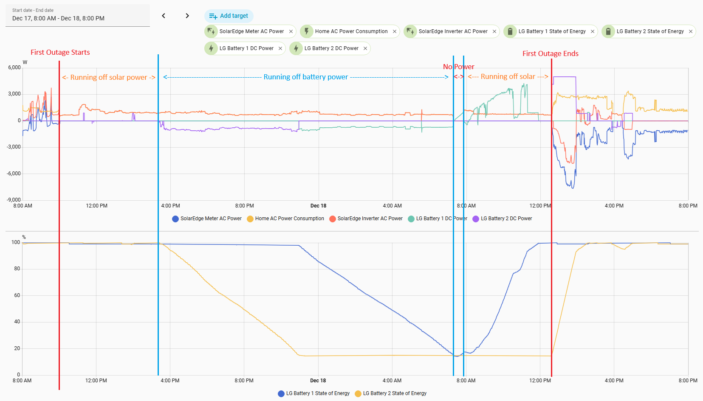
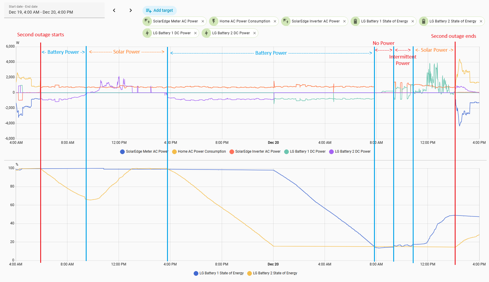

+++
title = "Public Safety Power Shutoffs: Take II"
date = 2026-03-15T03:03:03-06:00
draft = true
show_reading_time = true
summary = """
For the second, third, and fourth time in Boulder history, Xcel energy
shut off the power across the city to reduce the risk of wildfires.
I previously wrote about
[how we handled](/posts/2024_spring_power_outage/)
the first ever 2024 PSPS running off our solar panels and
batteries. This is a look at how we fared with the more recent
shut offs as these events become the new normal in Boulder.
"""
+++

Turns out planned power outages are becoming the new normal. Following
Boulder's [April 2024 outage](/posts/2024_spring_power_outage/), we
almost made it through 2025 without a repeat. But it was not to be --
a combination of dry weather and high winds led to not one, but two,
public safety power shutoffs the week of Monday, December 15th, 2025.
In total, these outages led to over 57 hours without power over the
course of four days. Since then, we kicked off 2026 with yet another
PSPS -- this time a five hour shutoff the afternoon and evening of
Saturday, March 24th.

I [previously wrote](/posts/2024_spring_power_outage/) about our
experience during the 2024 outage. Revisit that post for details.
In short -- our home is equipped with ~6.5 kW of solar capacity and
~20 kWh of battery capacity. We pull a base load of 500-750W, composed
mostly of the fridge, lighting, and a silly amount of computer and
network gear. Assuming we get some sun each day and can keep our load
average below 1 kW, we can run off grid indefinitely. When we
installed this system, we didn't expect to need that capability. Turns
out it's a useful capability to have in the age of rising wildfire
risk and a diminishing desire of utility companies to get sued.

We made it through the 28-hour outage in 2024 without ever losing
backup power. But April is much kinder to solar generation than the
Winter solstice. The back-to-back 2025 outages provided us with a
chance to test out the worst case solar scenario -- partial sun during
the shortest days of the year.

# The 2025 Shut Downs

The 2025/2026 winter in Boulder has been... somewhat non-existent. In
fact, it's the warmest Colorado winter [on
record](https://coloradonewsline.com/briefs/colorado-warmth-shatters-records/).
From November through now, we've had almost no snow and temperatures
far above the historic average. But that hasn't stopped Boulder's
increasingly notorious Winter wind storms. On Monday, December 15th,
Xcel (the local power company) started sending out notices about the
potential need for a planned power shutoff due high wind. This was an
improvement over the 2024 outage where we had less than 24 hours of
notice about the planned shutoff. So cheers to Xcel for providing more
of a heads up this time around.

The shutoff was planned to run from Noon to 6PM on Wednesday, December
17th. From Monday morning through Wednesday morning, we received four
increasingly specific emails about the planned shutoff. The final
email sent Wednesday morning moved the start time of the shutoff up
two hours to 10AM to account for the wind starting earlier than
expected.

Here are the outage timelines (rounded to nearest 5 minute interval).

## First Outage

* 2025-12-15 9:05 AM -- Xcel sends initial notice of possible shutdown via email
* 2025-12-16 10:35 AM -- Xcel sends second notice of planned shutoff for 2025-12-17
from Noon to 6 PM
* 2025-12-16 6:05 PM -- Xcel sends third notice of planned shutoff
* 2025-12-17 8:50 AM -- Xcel sends final notice that a planned shutoff will
begin at 10 AM. They also note the potential need for a second shutoff on 2025-12-19
starting at 6 AM.
* 2025-12-17 10:00 AM -- Xcel cuts power in most of Boulder
* 2025-12-17 11:45 AM -- Xcel sends an email noting an expected restoration time of
7:45 PM on 2025-12-17
* 2025-12-18 11:35 AM -- Xcel sends a second email with a revised restoration time of
8 PM on 2025-12-18
* 2025-12-18 12:35 PM -- Xcel restores power, ending a ~26.5 hour outage.
* 2025-12-18 1:00 PM -- Xcel sends an email noting power has been restored.
* 2025-12-18 4:15 PM -- Xcel sends a third email reiterating the restoration time of
8 PM on 2025-12-18 (the power is already back at this point)
* 2025-12-18 4:40 PM -- Xcel sends another email noting power has been restored.

## Second Outage

* 2025-12-17 5:40 PM -- Xcel sends notice of a planned outage on 2025-12-19 starting at 5 AM
* 2025-12-18 5:30 PM -- Xcel sends another notice of a planned outage for 2025-12-19 from
5 AM to 6 PM
* 2025-12-19 5:55 AM -- Xcel cuts power to most of Boulder for the second time in a week
(roughly 17.5 hours after the previous outage ended)
* 2025-12-19 6:20 AM -- Xcel sends an email with an expected power restoration time of 10 PM
on 2025-12-20 (the next day)
* 2025-12-19 7:20 AM -- Xcel sends another email with an expected power restoration time
of 6:45 PM on 2025-12-19 (the current day)
* 2025-12-19 12:40 PM -- Xcel sends another email with an expected power restoration time
of 10 PM on 2025-12-20 (the next day)
* 2025-12-19 8:50 PM -- Xcel sends an email noting that power restoration has begun,
but that some customers may not have power back until Noon on 2025-12-21 (two days later)
* 2025-12-20 9:15 AM -- Xcel sends another email with an expected power restoration time
of 10 PM on 2025-12-20
* 2025-12-20 11:30 AM -- Xcel sends me my monthly bill (way to read the room, Xcel)
* 2025-12-20 2:05 PM -- Xcel restores power, ending a ~32 hour outage
* 2025-12-20 3:05 PM -- Xcel sends an email noting power has been restored

# System Performance

So how'd we do?

In general, we fared pretty well for a combined total of 57 hours
without power within a 96 hour period (in the computer business, we'd
say Xcel had an uptime of <60%). Overall, we were only without power
for a few limited periods across both outages -- both in the early
morning between when the batteries died and before the sun was high
enough to power the house.

But a picture is worth a thousand words. Here is the first outage:

1. From when Xcel shuts off the grid around 10:00 AM on 2025-12-17
   until around 3:30 PM that afternoon, we are running off solar. The
   batteries stay fully charged.
2. From 3:30 PM on the 17th through about 7:15 AM the next morning, we
   run off our two batteries. The first battery hits its 15% lower limit
   around 11 PM at which point the system switches over the second
   battery.
3. Around 7:15 AM on the 18th, the second battery hits the 15% lower limit
   and we lose power. The power is out for about 40 minutes until the sun
   is up enough at 7:55 AM to start powering the house again.
4. From 7:55 AM until the outage ends at 12:35, the house runs off solar.
   Despite it being overcast, there's still spare solar capacity and this
   is used to recharge the first battery. The first battery finishes recharging
   around Noon just before the power is restored at 12:35.[^1]
5. Once grid power comes back at 12:35, the second battery recharges from the
   grid. Normally the batteries are only programmed to charge from solar, but
   when the system detects a storm that might lead to outages, it switches into
   "Weather Guard" mode where it will keep the batteries fully charged,
   including recharging them from grid power when necessary.

[^1]: The second battery should have started recharging off spare
solar at Noon when the first battery finished. There seems to be a
bug in our system where one battery fails to recharge when the grid is
down. We're working with our installer and SolarEdge to fix this.

And here's the second outage:

1. From when the outage starts around 5:55 AM on 2025-12-19 until 9:45
   AM, the system is running off battery power, discharging one battery
   to ~65%.
2. From 9:45 AM through 3:45 PM, the system runs off solar power,
   recharging the discharged battery to 100%
3. From 3:45 PM through 7:50 AM the next morning, we run off
   battery power. Around midnight we switch from one battery
   to the other as the first hits the 15% minimum.
4. Around 7:50 AM, both batteries are depleted to 15%.
   We lose power for about 1.5 hours until 9:20 AM when the sun
   is up enough to start powering us again.
5. It's overcast so the solar is not consistent.
   And the batteries are still drained. As a result,
   from 9:20 AM through around 11:00 AM, the house power cycles
   as the sun comes and goes.
6. From around 11:00 AM through when the grid comes back at
   around 2:05 PM, we run off solar. One battery recharges
   intermittently during this time as spare solar is available.

Overall, we made it 57 hours of outages with only around 3 hours of
downtime. Not bad for the least sunny time of year, and with cloud
cover nonetheless.

# The 2026 Shut Down

[//]: # https://coloradosun.com/2025/12/17/xcel-public-safety-power-outages-wednesday/
[//]: # https://www.cpr.org/2025/12/17/xcel-power-shutoff-high-winds-wednesday/
[//]: # https://coloradosun.com/2026/01/02/911-service-boulder-county-mountain-towns-gold-hill-jamestown-colorado/
[//]: # https://boulderreportinglab.org/2026/01/08/xcel-power-shutoffs-in-boulder-left-senior-housing-residents-at-risk-of-losing-access-to-oxygen/
[//]: # https://www.cpr.org/2026/01/15/businesses-impacted-xcel-wind-power-outage/
