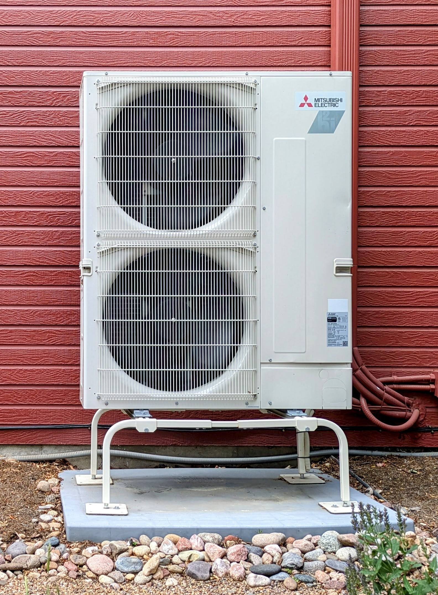
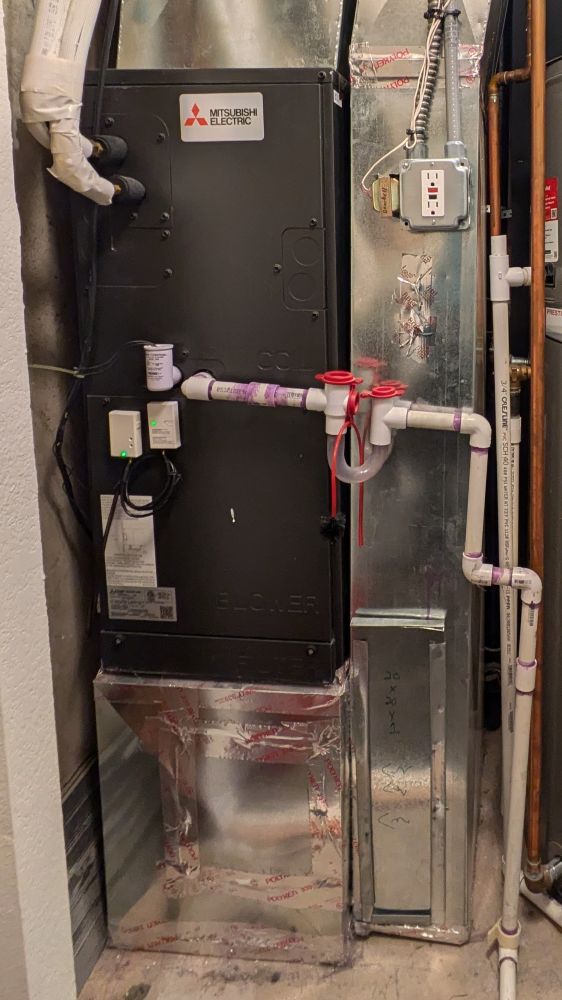
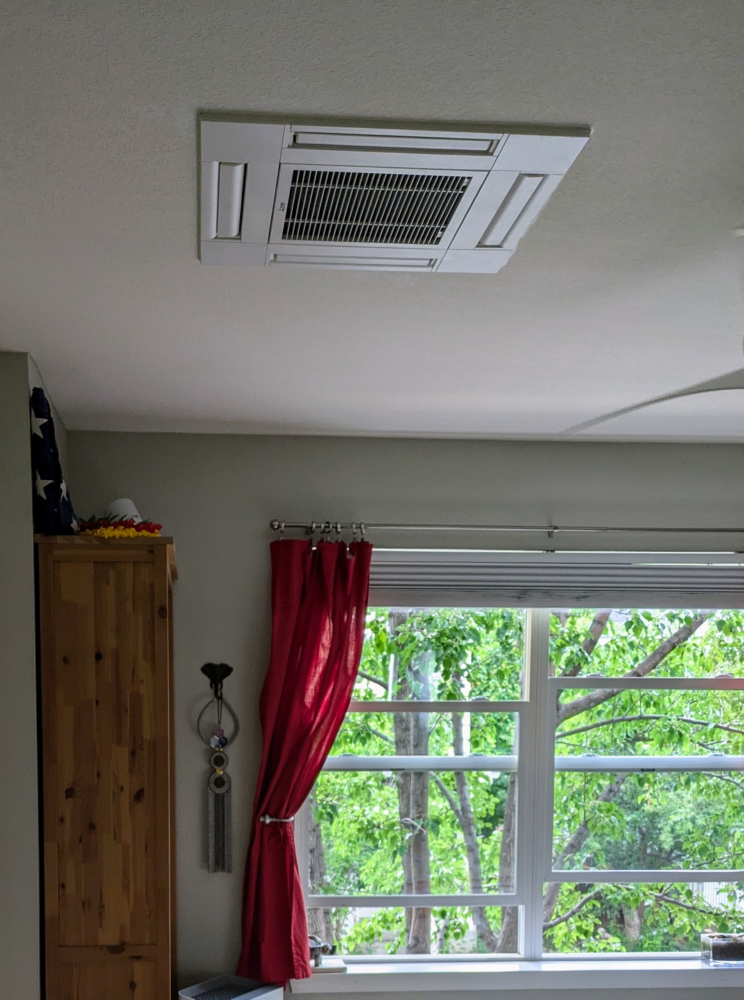
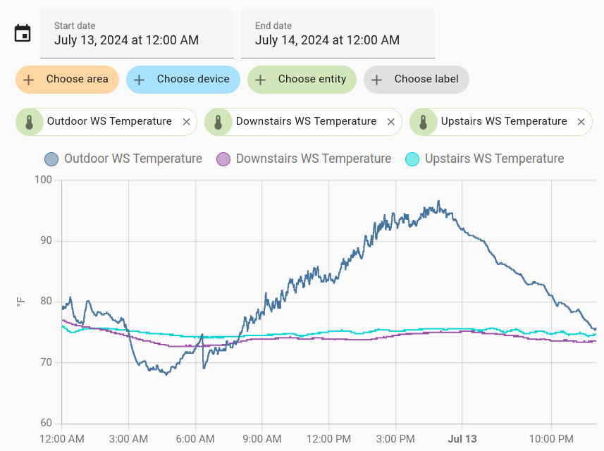
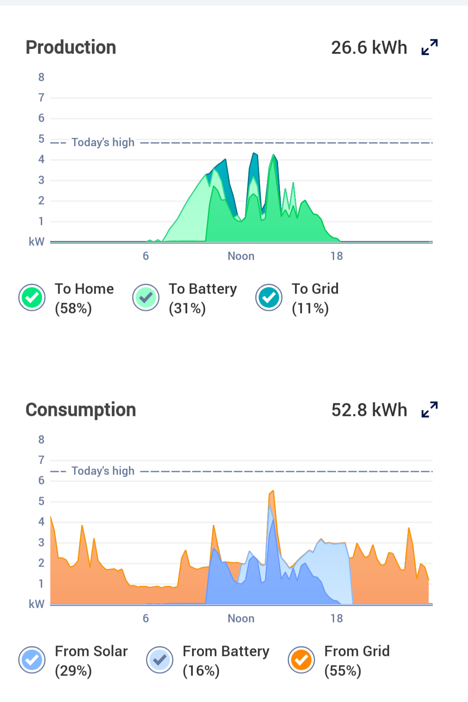
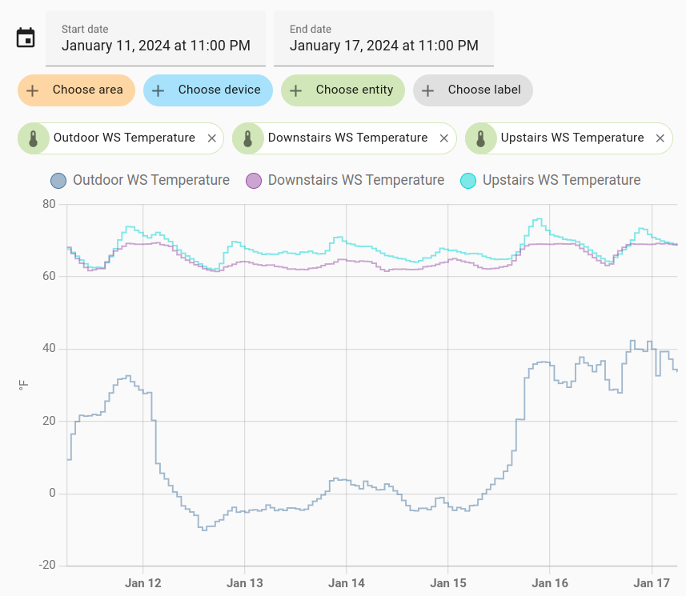
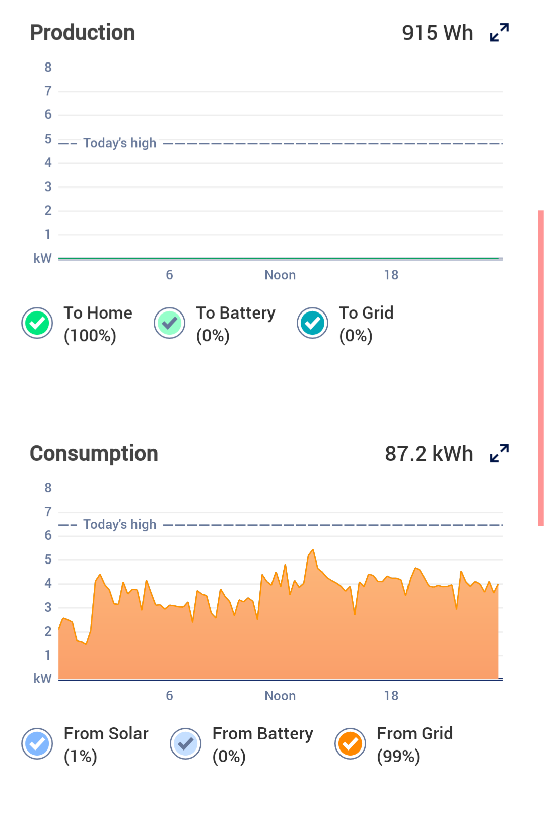

+++
title = "Heat Pumps! Heat Pumps! Heat Pumps!"
date = 2024-08-11T20:03:03-06:00
draft = false
show_reading_time = true
summary = """
An overview of heat pumps, and why they're a great way to heat or cool
your home without using fossil fuels. We share our experience using a
cold-weather heat pump deployment in as mid-sized Boulder home.
"""
+++

Heat Pumps are one of those delightful technologies that do pretty
much what they say on the tin. They transfer thermal energy (called
"heat") from one location to another.[^1] Everyone has encountered
heat pumps: your refrigerator is a one-way heat pump that transfers
heat from the inside of the fridge to the air in your kitchen -- they
cool your food, warming your house a bit in the process. Similarly, an
air conditioner is another one-way heat pump -- it cools your house by
pumping heat from the air indoors to the air outside.

[^1]: There are different kinds of heat pumps. The heat pumps we'll
focus on here are called [air source heat
pumps](https://en.wikipedia.org/wiki/Air_source_heat_pump) because the
medium they are exchanging heat with is the (generally outdoor) air.

Refrigerators and AC units are both heat pumps, but in modern
parlance, we tend to reserve the use of the term "heat pump" for
bidirectional systems -- capable of both heating and cooling depending
on which direction they are run. Modern home heat pumps are a lot like
traditional ACs, but with the capability to run in reverse. As a
result they can pump heat from inside of your house to the outside
(cooling your house), or they can pump heat from outside your house to
the inside (heating your house in the process). Sometimes, we also use
the term "heat pump" for systems that only run in the heating
direction (for example, a heat pump water heater). Heat pumps that
only cool tend to be called air conditioners (or refrigerators when
they are cooling your food rather than your air). But at the end of
the day, refrigerators, ACs, home heat pumps, and heat pump water
heaters are all examples of the same underlying heat pump
principle. They consume electricity to move heat from one location to
another.

# And I care, why?

It turns out that if we want to continue to live on this planet, we
really need to stop burning fossil fuels. One of the main uses of
fossil fuels is home heating. In the Western United States this takes
the form of the ubiquitous gas furnace -- which burns natural gas in
order to heat your home in the winter. Even if we succeed in
converting all electrical generation capacity to non-fossil fuel
means, the use of fossil fuels in home heating will continue to
contribute unsustainable greenhouse gas emissions to our atmosphere.

If we can't keep heating our homes by burning fossil fuels, what are
the alternatives? If you live in very specific places, you could tap
the Earth's geothermal energy.[^2] But this option is very expensive
and extremely limited in where it can be applied. We could go back to
burning trees (or other organic matter) for home heat, the way our
ancestors did, but that requires a lot of work and raises significant
air quality and fire safety concerns. We could design homes to use
passive solar heating, which is great, but again, is limited to
specific locations and new construction.

[^2]: Some people use the term "geothermal energy" to refer to [ground
source heat
pumps](https://en.wikipedia.org/wiki/Ground_source_heat_pump). Ground
source heat pumps are heat pumps that use the relatively constant
temperature of the ground (once you dig down 5-10 feet) as a thermal
reservoir that they can pump heat to/from. This is quite different
from the traditional use of the "geothermal energy" term that refers
to using highly heated water from geothermally active parts of the
Earth's crust to drive electrical turbines or heat buildings.

If we want a generally applicable, reasonably practical home heating
method that doesn't burn fossil fuels, we're going to need to use
electricity to heat our homes. There are two ways to do that. The
naive way is electrical resistance heating: basically running a lot of
electrical current through small wires causing them to heat up. This
is very simple and very expensive. While electrical resistant heaters
are technically 100% efficient (all of the electricity they consume is
being turned into heat), turning high-quality energy like electricity
directly into a low-quality energy like heat is rarely economically
advantageous.

To demonstrate, look at the cost differences for electricity (a
high-quality form of energy) and natural gas (a lower-quality form of
energy). At the moment, electricity in Boulder, CO costs residential
users somewhere in the range of $0.10 to $0.20 per kWh including taxes
and fees. Meanwhile, natural gas costs roughly $1/therm. 1 therm is
equivalent to 29 kWh, which means the price of gas is roughly $0.03
per kWh, or about one fifth the median electrical price of $0.15 per
kWh. We could use electrical resistance heating to heat our homes, but
we'd increase heating costs by roughly 5x.

Fortunately there's the less naive way to heat with electricity -- use
a heat pump. While electrical resistance heating turns 100% of the
electricity expended into heat, heat pumps do better -- they provide
more heat than the energy they consume.[^3] Instead of converting
electricity directly into heat, heat pumps use electricity to move
heat around. As a result, it is not uncommon to find heat pumps that
provide "efficiencies" in the 200% to 400% range (e.g. that move 2x to
4x as much heat as the energy they consume). That goes a long ways to
cutting into the cost advantage of natural gas, and puts us in the
range of being able to heat homes using electricity for roughly the
same cost as heating a home using fossil fuels (and in places where
expensive fossil fuels like heating oil are used, heat pumps can be
quite a bit cheaper).

[^3]: While this may seem like a blatant violation of the first law of
thermodynamics, it is really just a clever abuse of how we draw the
thermodynamic system boundaries. No heat is being created -- it's just
being moved around.

# Heat Pumps in Practice

This all sounds nice in theory, but what does it look like in
practice? Can air source heat pumps handle places with cold winters?
How can you harvest heat from sub-freezing outdoor air?

In 2020, we replaced the 20-year-old gas furnace (as well as an aging
traditional central AC unit) in our 1600 square foot,
1999-construction home with a cold-weather rated Mitsubishi multi-zone
Hyper-Heat heat pump. The installed system consisted of an
MXZ-4C36NAHZ 36K BTU outdoor unit, an SVZ-KP18 18K BTU central air
handler (to replace the old furnace) and two SLZ-KF09 9K BTU
ceiling-mounted mini-split heads for the upstairs bedrooms. This
system has a number of desirable qualities:

* It replaces the old furnace and AC unit with the SVZ-KP18 central
  air handler, allowing us to reuse the home's existing single-zone
  duct-work to heat and cool the common areas of the home.
* It adds SLZ-KF09 individually-controllable mini-split heads to the
  upstairs bedrooms, allowing us to control the temperature in these
  rooms as separate zones. These units also do a far better job
  cooling the previously too-warm upstairs than the central duct-work
  ever did (pumping cold, heavy air through duct work from a basement
  to a second floor is hard to do).
* It is rated to operate down to an outdoor air temperature of -17
  degrees Fahrenheit, which is about as cold as it ever gets in
  Boulder, CO.

This system cost us ~$21K to install in 2020 with equipment, tax, and
labor. Of that, we got ~$1K back in various rebates from Boulder and
the local power utility (Xcel). We had our system install by [Save
Home Heat](https://savehomeheat.com/), which is a local HVAC company
that specializes in heat pumps and related technologies. At the time,
they were one of the few local companies with experience in this
space. In the past four years, however, many other companies have
gotten comfortable working in this space. Like most things, the prices
have also gone up -- but the so have the [available tax
rebates](https://www.forbes.com/home-improvement/hvac/heat-pump-tax-credit/)
thanks to federal and state efforts.

You can see the MXZ-4C36NAHZ outdoor compressor in the photo at the
start of this post. It uses dual horizontally facing fans to move air
through a heat exchanger and heat/cool compressed refrigerant in the
process.

Here is the SVZ-KP18 central air unit. It sits pretty much where the
old furnace used to sit and attaches to the existing duct work that ran
to that location. One note on this -- heat pumps heat air more slowly
than a gas furnace, and as a result, duct work designed for gas
furnaces is often somewhat undersized for a heat pump. In our case,
it still works out fine, but in larger homes you may bump up against
limits as to how well a heat pump will work with legacy duct work. In
those cases, you can always turn to mini-split heads to augment the
existing duct work. Which brings us to...

Here is one of the two SLZ-KF09 mini-split heads we installed to
augment the legacy duct work in our upstairs bedrooms. These are
ceiling-mounted units, which work well if you have plenty of workspace
(like an attic) above your ceiling. Functionally, they work the same
way the more common wall-mount units work, but aesthetically they have
the advantage of blending into the room a bit better.

# But does it work?

So how well does this system perform? Let's start with the cooling
capacity. Here's the indoor and outdoor temperatures in a recent
24-hour period where the outdoor temperature peaked in the high 90s --
one of our hotter summer days here in Boulder.

As you can see, the system does a reasonable job of holding both the
downstairs (served by the central air handler and legacy duct work) and
the upstairs (served by the mini splits) at around 75 degrees F (which
is the temperature we leave the thermostats set to in the summer).

And how much energy does it take to do this? Well, here's the
snapshot of our home's energy consumption (and solar production) on
the day shown in the temperature graph above.

It's a bit difficult to filter out all the other energy uses inherent
in this chart, but compared against our base-load of ~1KW (the dip in
the consumption graph around 6AM), you can see the heat pump is
driving roughly another 1KW in additional electrical load throughout
the day (the other spikes in the graph are cooking and the like). Not
accounting for our solar capacity (which helps lower the cost), if we
assume the heat pump runs for 20 hours of the day, that translates to
a cooling cost of roughly $3 for one of the hottest days of the
year. Not too shabby!

At the other end of the spectrum (and where folks tend to worry more
about heat pumps in Colorado), let's look at Boulder's coldest week
this past winter where we had multiple days of sub-zero temperatures.

Here you can see the system keeping the house above 60 degrees F,
despite temperatures in the negative single digits. You can tell the
system is operating near its limit on some of these days -- it holds
the house above 60F but struggles to hit the thermostat set point of
68. As soon as the outdoor temperature swings back up to positive
temps, the system recovers quickly and heats the house back into the
70 degree range.

But what about energy usage? Heat pump energy usage is proportional to
the difference between the indoor and outdoor temperature. That means
that you generally use more energy to heat than to cool: very cold
days like this have a 70+ degree difference between the indoor and
outdoor temperatures, vs the hottest summer days where that difference
is only 30 degrees. Here's the energy production and consumption graph
from January 13th, 2024 -- the coldest day in the graph above.

Here you can see the heat pump driving ~2KW of consumption above our
base load, pushing up toward 3KW at times. Couple this with the fact
that there was snow on the ground (and our solar panels), and these
sorts of days get a bit expensive. If we assume the heat pump consumed
~60KWh of energy throughout this sub-zero day, that translates to a
cost of $9 to heat the home that day. But this is pretty much the
worst possible case. A more typical winter day costs a half to a third
of that. Using a heat pump generally means your electrical bills go up
in the winter, but not an unmanageable amount.

One item to note -- you can opt to install a heat pump with backup
electric resistance coils that kick in in situations like this. We
opted not to do that, in part because we like to live dangerously, and
in part because of the added cost and hassle. As you can see, the
system still meets our needs, even during the one sub-zero week
Boulder gets each year. But if you prefer to have more buffer, you can
always add the electric resistance coils to the main air handler as a
backup (at the cost of higher energy usage on these very cold days).

# Lessons Learned

Four years in, we've been very pleased with our heat pump install. Not
only does it cool the house far better than the original AC unit ever
did, but it has met our heating needs through three Colorado winters
(including multiple sub-zero days). All without needing to burn any
fossil fuels to operate (we use a mix of home solar and grid
renewables for our electrical mix). We have learned a few lessons
throughout this process:

* Because heat pumps heat more slowly than a gas furnace, it's best to
  leave the heat set to a consistent value when it is very cold
  (single digits) outside, vs letting the thermostat drop 10+ degrees
  overnight as you might with a furnace. Heat pumps maintain
  temperature well, even when it's very cold outside, but they don't
  do a great job making up heating a house up once the temperature has
  dropped.
* Most of the winter, we can get away with just using the central air
  handler to heat the house. Since hot air rises, the upstairs ceiling
  units are less critical. But when it is very cold, it does help to
  turn on the ceiling units as well to take full advantage of the
  outdoor unit's throughput to maximize heating capacity.
* In the summer, the upstairs ceiling units are extremely useful for
  cooling the home. Having cooling capacity at the top of the house
  where the cool air can then make its way downstairs is a lot more
  effective than trying to use the central air handler to pump cold
  air for the basement to the second floor.
* Heat pumps introduce as additional resiliency concern: you are now
  dependent on electricity to heat your home (although that also tends
  to be true of a furnace). We're exploring adding a wood stove as an
  emergency backup heat source to help provide protections against
  [extended power outages](/posts/2024_spring_power_outage/).

Heat pumps are a technology that provide both climate prevention (they
help reduce fossil fuel usage) and adaptation (they help cool homes as
temperatures rise). They also have the nice property that, at least in
cold-weather regions, they will become more efficient as the climate
warms. But even without additional warming, air-source heat pumps have
reached the point where they are a feasible means of heating and
cooling homes in most regions of the United States. If you're looking
to replace an existing fossil-fuel based HVAC system, they're worth a
look.
